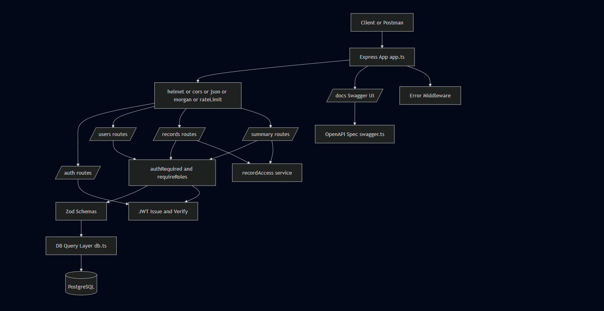
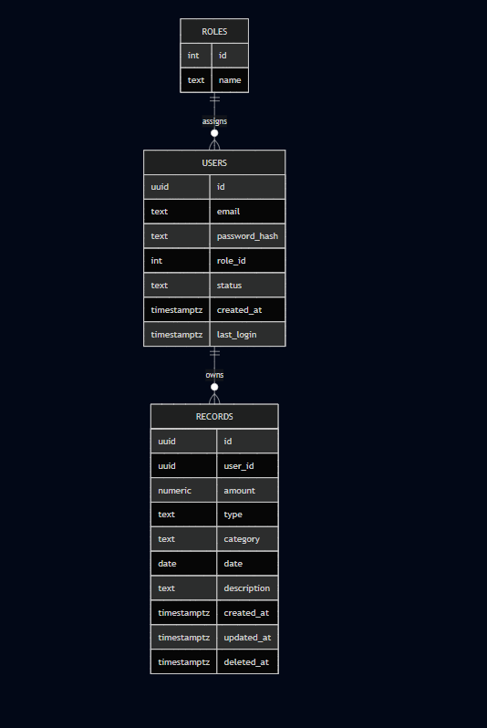

# Zorvyn FinTech Backend (Assignment)

Node.js + TypeScript backend for finance data processing and access control.

## Architecture and Trade-offs

- Detailed architecture diagram and one-page decision log:
  - `docs/architecture-and-tradeoffs.md`

## Diagrams

### Architecture Diagram



### ER Diagram


## Stack

- Node.js + Express + TypeScript
- PostgreSQL (required persistence)
- Redis (optional cache/infra-ready)
- JWT authentication
- Role-based access control (Viewer, Analyst, Admin)
- Zod validation

## About Supabase and GraphQL

- Supabase is possible because it uses PostgreSQL under the hood, so it satisfies the assignment's persistence requirement.
- GraphQL is optional in this assignment. REST APIs are fully valid because the prompt allows REST, GraphQL, or equivalent backend interface.
- For Supabase pooled connections, this project enables SSL with relaxed certificate verification in Node `pg` to avoid local certificate-chain issues.

## Features Implemented

- User management with roles and active/inactive status
- RBAC-protected endpoints
- Financial records CRUD with soft delete
- Filtering and pagination on records list
- Text search support on records list (`q` over category and description)
- Dashboard summary endpoints:
  - total income/expense/net balance
  - category-wise totals
  - recent activity
  - weekly/monthly trends
- Input validation and consistent error handling
- Basic rate limiting middleware
- Swagger/OpenAPI docs at `/docs`
- Small automated test suite for auth, records, and summary

## Project Structure

- `src/server.ts`: app bootstrap
- `src/app.ts`: middleware and routes
- `src/routes/*`: auth/users/records/summary endpoints
- `src/middlewares/*`: auth, RBAC, rate limit, errors
- `src/schemas.ts`: request/query validation
- `src/db.ts`: PostgreSQL pool
- `src/redis.ts`: Redis client
- `sql/001_init.sql`: schema
- `sql/002_seed_roles.sql`: role seed

## Setup

1. Install dependencies:

```bash
npm install
```

2. Configure environment:

```bash
copy .env.example .env
```

3. Create PostgreSQL database (example):

```sql
CREATE DATABASE zorvyn_finance;
```

4. Initialize database schema and seed roles:

```bash
npm run db:init
```

5. Create first admin user:

```bash
npm run user:create-admin -- admin@zorvyn.com StrongPass123!
```

6. Start development server:

```bash
npm run dev
```

7. Open API documentation:

```text
http://localhost:4000/docs
```

## Auth and RBAC

- Login endpoint: `POST /auth/login`
- Send token as `Authorization: Bearer <token>`
- Roles:
  - `viewer`: read-only records + summaries
  - `analyst`: create records + read records/summaries
  - `admin`: full user and record management

## RBAC Matrix

| Action | Viewer | Analyst | Admin |
|---|---|---|---|
| Login | Yes | Yes | Yes |
| Create user | No | No | Yes |
| List users | No | No | Yes |
| Get user by id | No | Yes | Yes |
| Update user | No | No | Yes |
| Delete user | No | No | Yes |
| Create record | No | Yes | Yes |
| List/get records | Yes | Yes | Yes |
| Update record | No | No | Yes |
| Delete record (soft) | No | No | Yes |
| View summaries | Yes | Yes | Yes |

## API Summary

### Auth

- `POST /auth/login`

Sample request:

```json
{
  "email": "admin@zorvyn.com",
  "password": "StrongPass123!"
}
```

Sample response:

```json
{
  "token": "<jwt-token>"
}
```

### Users

- `POST /users` (admin)
- `GET /users` (admin)
- `GET /users/:id` (admin, analyst)
- `PUT /users/:id` (admin)
- `DELETE /users/:id` (admin)

### Records

- `POST /records` (analyst, admin)
- `GET /records` (viewer, analyst, admin)
- `GET /records/:id` (viewer, analyst, admin)
- `PUT /records/:id` (admin)
- `DELETE /records/:id` (admin, soft delete)

Search example:

```text
GET /records?q=rent&page=1&limit=10
```

Sample create request:

```json
{
  "amount": 2500,
  "type": "income",
  "category": "salary",
  "date": "2026-04-02",
  "description": "Monthly salary"
}
```

### Summary

- `GET /summary/total`
- `GET /summary/category`
- `GET /summary/recent?limit=10`
- `GET /summary/trends?interval=monthly|weekly&from=YYYY-MM-DD&to=YYYY-MM-DD`
- `GET /summary/analytics`

Sample total response:

```json
{
  "totalIncome": "2500.00",
  "totalExpense": "800.00",
  "netBalance": "1700.00"
}
```

## Testing

Run tests:

```bash
npm test
```

Current suite covers:

- Cross-user record access protection
- Inactive user blocked from protected endpoints
- Duplicate email conflict on user create/update
- Summary scoping behavior for non-admin and admin roles

## CI and Deployment

- GitHub Actions CI runs on every push and pull request via [.github/workflows/ci.yml](.github/workflows/ci.yml).
- Render deployment is configured with [render.yaml](render.yaml).

Render setup:

1. Create a new Render Web Service from this repository.
2. Let Render read [render.yaml](render.yaml) as the blueprint.
3. Set required environment variables in Render:
  - `DATABASE_URL`
  - `JWT_SECRET`
  - `PORT` is provided by Render at runtime
4. Deploy with the default build and start commands from the blueprint.

## Demo Automation

PowerShell demo script:

```bash
./scripts/demo.ps1
```

Postman collection:

- Import `postman_collection.json`
- Set `token` variable from `/auth/login` response

## Design Decisions

- JWT + RBAC was kept because it is the clearest way to model role-based authorization in this assignment without introducing session infrastructure.
- Protected routes re-check current user status from the database to enforce deactivation immediately, even if a token is still valid.
- Record and summary reads are scoped by authenticated user for non-admin roles to enforce data access boundaries.
- Record delete remains soft delete (`deleted_at`) to preserve auditability and prevent accidental hard-loss in normal flows.
- Route handlers stay thin, with repeated access-scope SQL behavior extracted to a minimal shared helper.

## Known Limitations (By Assignment Scope)

- No refresh-token or token revocation system is implemented.
- No distributed Redis-backed rate limiting is implemented.
- No multi-tenant model is implemented.
- No event-driven architecture, CQRS, or heavy DDD layering is implemented.
- No production-grade observability stack (centralized tracing/metrics pipelines) is implemented.
- Pagination is simple offset/limit and does not use cursor-based semantics.

## Assumptions and Trade-offs

- Currency is treated as a decimal amount without currency code in the current schema.
- Multi-tenant separation is out of scope; this is a single-tenant assignment backend.
- `DELETE /records/:id` is soft-delete (`deleted_at`) for auditability.
- Redis is optional for local runs; app still starts if Redis is unavailable.
- Supabase PostgreSQL is used as managed Postgres; TLS compatibility is handled in code.
- GraphQL is optional per assignment brief; REST is used for clarity and speed.

## Security and Access Control

### Data Access Boundaries

- Non-admin roles are scoped to their own records and summaries.
- Admin role keeps global read visibility for records/summaries to match RBAC reporting needs.
- Record update/delete operations are ownership-restricted, including for admin.
- Cross-user record reads return `404 NOT_FOUND` to avoid disclosing resource existence.

### Authentication Flow

- Login generates JWT containing user ID, email, role, and status
- `authRequired` middleware verifies JWT signature AND checks current user status in database
- Real-time deactivation: Even with valid JWT, inactive users are rejected (`401 UNAUTHORIZED`)
- Trade-off: One DB query per protected request for real-time status check

### RBAC Implementation

- Viewer: Read-only access to records and summaries within role scope
- Analyst: Can create records in addition to viewer permissions
- Admin: Global read visibility plus user management; record writes remain ownership-scoped
- User management endpoints (create/update/delete users) are admin-only

### Error Response Standards

- `401 UNAUTHORIZED`: Missing/invalid token, user not found in DB, inactive user
- `403 FORBIDDEN`: Insufficient role permissions
- `404 NOT_FOUND`: Resource doesn't exist OR doesn't belong to authenticated user
- `409 CONFLICT`: Duplicate email on user creation/update
- `400 BAD_REQUEST`: Validation failure (Zod schema rejection)


